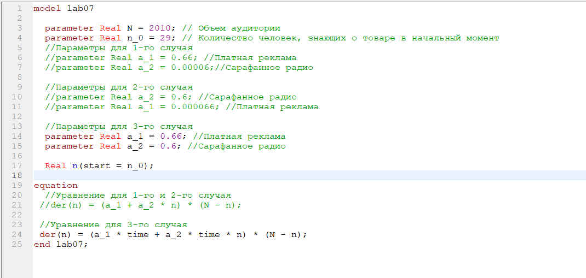
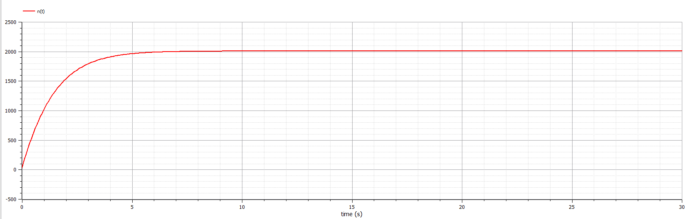
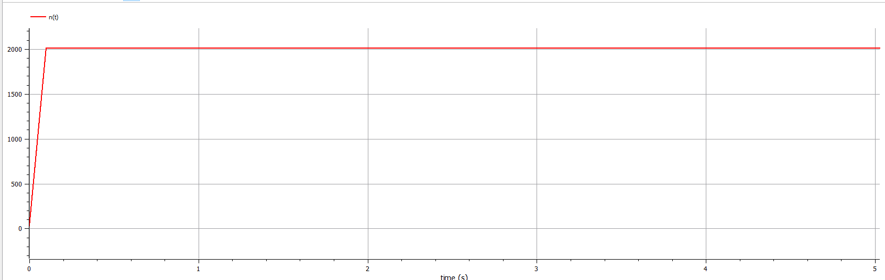
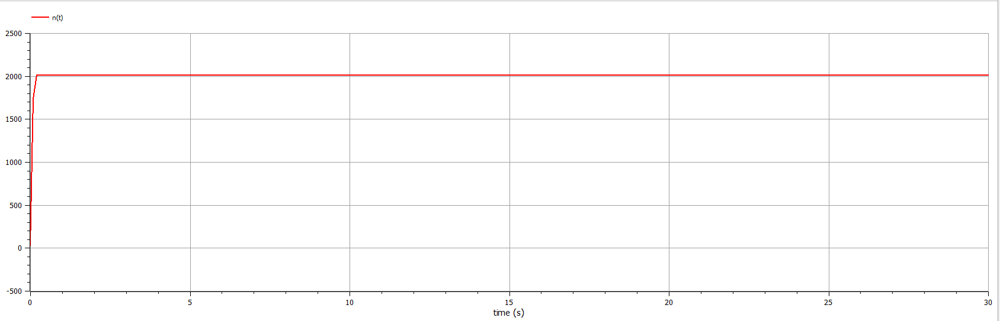

---
# Front matter
lang: ru-RU
title: "Лабораторная работа №7. Вариант 50."
subtitle: "Модель рекламной компании"
author: "Силкина Мария Александровна"

# Formatting
toc-title: "Содержание"
toc: true # Table of contents
toc_depth: 2
lof: true # List of figures
lot: true # List of tables
fontsize: 12pt
linestretch: 1.5
papersize: a4paper
documentclass: scrreprt
polyglossia-lang: russian
polyglossia-otherlangs: english
mainfont: PT Serif
romanfont: PT Serif
sansfont: PT Sans
monofont: PT Mono
mainfontoptions: Ligatures=TeX
romanfontoptions: Ligatures=TeX
sansfontoptions: Ligatures=TeX,Scale=MatchLowercase
monofontoptions: Scale=MatchLowercase
indent: true
pdf-engine: lualatex
header-includes:
  - \linepenalty=10 # the penalty added to the badness of each line within a paragraph (no associated penalty node) Increasing the value makes tex try to have fewer lines in the paragraph.
  - \interlinepenalty=0 # value of the penalty (node) added after each line of a paragraph.
  - \hyphenpenalty=50 # the penalty for line breaking at an automatically inserted hyphen
  - \exhyphenpenalty=50 # the penalty for line breaking at an explicit hyphen
  - \binoppenalty=700 # the penalty for breaking a line at a binary operator
  - \relpenalty=500 # the penalty for breaking a line at a relation
  - \clubpenalty=150 # extra penalty for breaking after first line of a paragraph
  - \widowpenalty=150 # extra penalty for breaking before last line of a paragraph
  - \displaywidowpenalty=50 # extra penalty for breaking before last line before a display math
  - \brokenpenalty=100 # extra penalty for page breaking after a hyphenated line
  - \predisplaypenalty=10000 # penalty for breaking before a display
  - \postdisplaypenalty=0 # penalty for breaking after a display
  - \floatingpenalty = 20000 # penalty for splitting an insertion (can only be split footnote in standard LaTeX)
  - \raggedbottom # or \flushbottom
  - \usepackage{float} # keep figures where there are in the text
  - \floatplacement{figure}{H} # keep figures where there are in the text
---

# Цель работы

Изучить модель рекламной компании нового товара или услуги. 

# Задачи

1. Построить графики распространения рекламы, математическая модель которых соответствует уравнениям моего варианта.

2. Определить в какой момент в случае 2 скорость распространения рекламы будет максимальна.

3. Ответить на вопросы к лабораторной работе.

# Теоретическое введение

Модель рекламной компании имеет следующий вид:
	$$ 
	\frac{dn}{dt} =(\alpha_1(t) + \alpha_2(t) n(t))(N - n(t))
        $$

где 
$\alpha_1$ - интенсивность рекламной компании;

$\alpha_2$  - распространение информации о товаре среди потенциальных покупателей, не знающих о нем;

$N$ - общее число потенциальных платежеспособных покупателей;

$n(t)$ - число уже информированных клиентов;

$\frac{dn}{dt}$ - скорость изменения числа потебителей со временем.

# Выполнение лабораторной работы

## Код программы 

Код програмы написан на языке Modelica. 

model lab07
  
  parameter Real N = 2010; // Объем аудитории

  parameter Real n_0 = 29; // Количество человек, знающих о товаре в начальный момент

  //Параметры для 1-го случая

  //parameter Real a_1 = 0.66; //Платная реклама
  //parameter Real a_2 = 0.00006;//Сарафанное радио

  
  //Параметры для 2-го случая

  //parameter Real a_2 = 0.6; //Сарафанное радио

  //parameter Real a_1 = 0.000066; //Платная реклама

  
  //Параметры для 3-го случая

  parameter Real a_1 = 0.66; //Платная реклама

  parameter Real a_2 = 0.6; //Сарафанное радио

  
  Real n(start = n_0);
  

equation

//Уравнение для 1-го и 2-го случая

//der(n) = (a_1 + a_2 * n) * (N - n);

 
 //Уравнение для 3-го случая

 der(n) = (a_1 * time + a_2 * time * n) * (N - n);

end lab07;

## Ход работы

Уравнения модели рекламной компании для моего варианта имеют следующий вид:

1. $\frac{dn}{dt} =(0.66 + 0.00006 n(t))(N - n(t))$

2. $\frac{dn}{dt} =(0.000066 +0.6n(t))(N - n(t))$

3. $\frac{dn}{dt} =(0.66t + 0.6*t*n(t))(N - n(t))$

где N = 2010, n(0) = 12.

Мною был написан код программы, который выводит графики, нужные в задачах. (рис 1. -@fig:001)  

{ #fig:001 width=70% }

Ниже приведен график распространения рекламы для первого случая. На данном графике мы можем увидеть, что в момент времени t = 0.1s  скорость распространения рекламы достигла своего максимума.(рис 2. -@fig:002)  

{ #fig:002 width=70% }

На следующем рисунке изображен график математической модели для второго случая  (рис 3. -@fig:003)  

{ #fig:003 width=70% }

Последнее изображение - это график распостранения рекламы для математической модели заданной третьим уравнением в условии моего варианта.  (рис 4. -@fig:004)   

{ #fig:004 width=70% }

# Ответы на вопросы

## Записать модель Мальтуса (дать пояснение, где используется данная модель)

Модель Мальтуса имеет следующий вид, когда $\alpha_1(t)\gg\alpha_2(t)$ :

	$$ 
	\frac{dx}{dt} =r * x
        $$

Ее решением является функция :

$$ x(t) =x_0 * e^{rt} $$

где $x_0$  -  начальная численность популяции.

Данная модель применяется в физике, в исследовании роста популяции.

## Записать уравнение логистической кривой (дать пояснение, что описывает данное уравнение)

$$ 
	\frac{dP}{dt} =r * P(1 - frac{P}{K}
        $$

где 
$P$ - численность популяции;

$t$ - время

$r$ - стратегия, которая предполагает бурное размножение и короткую продолжительность жизни особей;

$K$ - стратегия - низкий темп размножения и долгая жизнь.

Используется данная модель в экономике, экологии, статистике и машинном обучении, медицине и химии.

## На что влияют коэффициенты $\alpha_1$  и  $\alpha_2$ в модели распространения рекламы

Данные коэффициенты, а именно их сравнение влияет на получение определенного типа модели, либо Мальтуса, либо же  Ферхюльста.

Когда $\alpha_1(t)\gg\alpha_2(t)$, то получается модель Мальтуса, которая показывает бесконечный рост и его быстрый темп(ответ на вопрос 4). В обратной же ситуации(вопрос 5), когда $\alpha_1(t)\||\alpha_2(t)$ , то все сводится к логистической кривой, которая сначало увеличивается экспоненциально, а потом ее рост замедляется.

# Выводы

При выполнении данной лабораторной работы я изучила модель распространения рекламы, а также ее преобразование в модель Мальтуса или в логистическую кривую при сравнении коэффициентов.